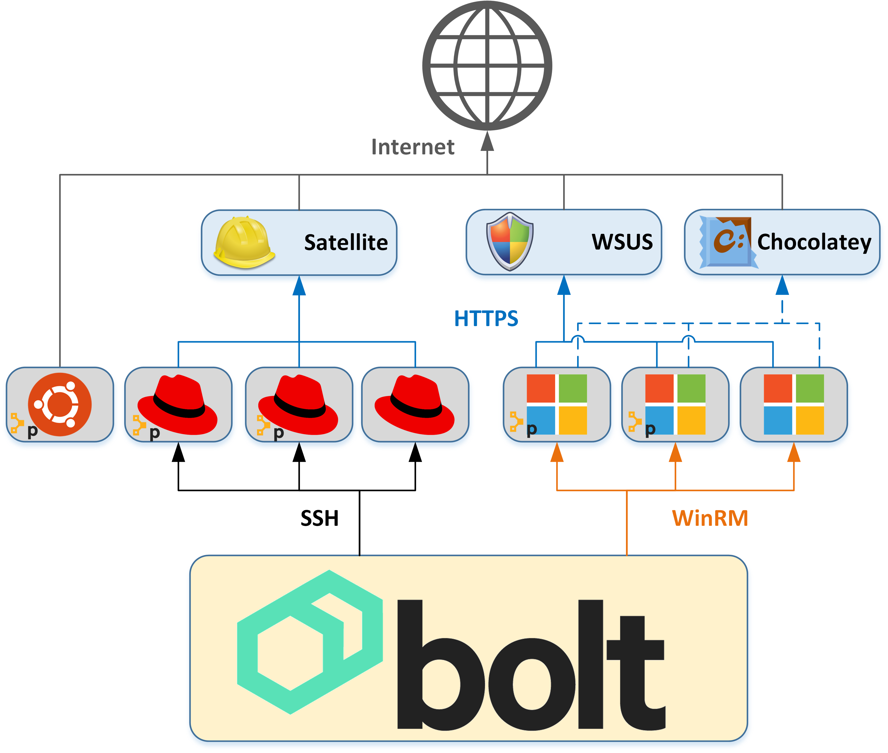

# patching

[](https://travis-ci.org/EncoreTechnologies/puppet-patching)
[](https://forge.puppet.com/encore/patching)
[](https://forge.puppet.com/encore/patching)
[](https://forge.puppet.com/encore/patching)
[](https://forge.puppet.com/encore/patching)
[](http://www.puppetmodule.info/m/encore-patching)


#### Table of Contents

- [Module description](#module-description)
- [Setup](#setup)
    - [Setup Requirements](#setup-requirements)
    - [Quick Start](#quick-start)
- [Architecture](#architecture)
- [Design](#design)
- [Patching Workflow](#patching-workflow)
- [Usage](#usage)
    - [Check for available updates](#check-for-available-updates)
    - [Disable monitoring](#disable-monitoring)
    - [Create snapshots](#create-snapshots)
    - [Perform pre-patching checks and actions](#perform-pre-patching-checks-and-actions)
    - [Deploying pre/post patching scripts](#deploying-prepost-patching-scripts)
    - [Run a the full patching workflow end-to-end](#run-a-the-full-patching-workflow-end-to-end)
    - [Patching with Puppet Enterprise (PE)](#patching-with-puppet-enterprise-pe)
- [Configuration Options](#configuration-options)
- [Reference](#reference)
- [Limitations](#limitations)
- [Development](#development)
- [Contributors](#contributors)


## Module description

A framework for building patching workflows. This module is designed to be used as building
blocks for complex patching environments of Windows and Linux (RHEL, Ubuntu) systems.

No Puppet agent is required on the end targets. The node executing the patching will need to 
have `bolt` installed.

## Setup

### Setup Requirements

Module makes heavy use of [bolt](https://puppet.com/docs/bolt/latest/bolt.html), 
you'll need to install it to get started. Install instructions are
[here](https://puppet.com/docs/bolt/latest/bolt_installing.html).

If you want to use the `patching::snapshot_vmware` plan/function then you'll
need the [rbvmomi](https://github.com/vmware/rbvmomi) gem installed in the
bolt ruby environment:

``` shell
/opt/puppetlabs/bolt/bin/gem install --user-install rbvmomi
```

### Quick Start

``` shell
cat << EOF >> ~/.puppetlabs/bolt/Puppetfile
mod 'puppetlabs/stdlib'
mod 'encore/patching'
EOF

bolt puppetfile install
bolt plan run patching::available_updates --targets group_a

# install rbvmomi for VMware snapshot support
/opt/puppetlabs/bolt/bin/gem install --user-install rbvmomi
```

## Architecture

This module is designed to work in enterprise patching environments.

Assumptions:
* RHEL targets are registered to Satellite / Foreman or the internet
* Ubuntu targets are registered to Landscape or the internet
* Windows targets are registered to WSUS and Chocolatey (optional)

Registration to a central patching server is preferred for speed of software downloads 
and control of phased patching promotions.

At some point in the future we will include tasks and plans to promote patches through
these central patching server tools.



## Design

`patching` is designed around `bolt` tasks and plans. 

Individual tasks have been written to accomplish targeted steps in the patching process.
Examples: `patching::available_updates` is used to check for available updates on targets.

Plans are then used to pretty up output and tie tasks together.

This way end users can use the tasks and plans as build blocks to create their own custom
patching workflows (we all know, there is no such thing as one size fits all).

_For more info on tasks and plans, see the Usage and Reference sections._

Going further, many of the settings for the plans are configurable by setting `vars` 
on your groups in the bolt inventory file.

_For more info on customizing settings using vars, see the Configuration Options section_

## Patching Workflow

Our default patching workflow is implented in the `patching` plan [patching/init.pp](patching.init.pp).

This workflow consists of the following phases:
* Organize inventory into groups, in the proper order required for patching
* For each group...
* Check for available updates
* Disable monitoring
* Snapshot the VMs
* Pre-patch custom tasks
* Update the host (patch)
* Post-patch custom tasks
* Reboot that require a reboot
* Delete snapshots
* Enable monitoring

## Usage

### Check for available updates

This will reach out to all targets in `group_a` in your inventory and check for any available
updates through the system's package manager:
* RHEL = yum
* Ubuntu = apt
* Windows = Windows Update + Chocolatey (if installed)

``` shell
bolt plan run patching::available_updates --targets group_a
```

### Disable monitoring

Prior to performing the snapshotting and patching steps, the plan will disable monitoring 
alerts in SolarWinds (by default).

This plan/task utilizes the `remote` transport []


``` shell
bolt plan run patching::monitoring_solarwinds --targets group_a action=disable' monitoring_target=solarwinds
```

### Create snapshots

This plan will snapshot all of the hosts in VMware. The name of the VM in VMware is assumed to 
be the `uri` of the node the inventory file.

``` shell
/opt/puppetlabs/bolt/bin/gem install rbvmomi

bolt plan run patching::snapshot_vmware --targets group_a action='create' vsphere_host='vsphere.domain.tld' vsphere_username='xyz' vsphere_password='abc123' vsphere_datacenter='dctr1'
```

### Perform pre-patching checks and actions

This plan is designed to perform custom service checks and shutdown actions before 
applying patches to a node.
If you have custom actions that need to be perform prior to patching, place them in the
`pre_update` scripts and this plan will execute them. 
Best practice is to define and distribute these scripts as part of your normal Puppet code
as part of othe role for that node.

``` shell
bolt plan run patching::pre_update --targets group_a
```

By default this executes the following scripts (targets where the script doesn't exist are ignored):
* Linux = `/opt/patching/bin/pre_update.sh`
* Windows = `C:\ProgramData\patching\pre_update.ps1`

### Deploying pre/post patching scripts

An easy way to deploy pre/post patching scripts is via the `patching` Puppet manifest or the `patching::script` resource.

Using the `patching` class:

``` puppet
class {'patching':
  scripts => {
    'pre_patch.sh': {
      content => template('mymodule/patching/custom_app_post_patch.sh'),
    },
    'post_patch.sh': {
      source => 'puppet:///mymodule/patching/custom_app_post_patch.sh',
    },
  },
}
```

Via `patching::script` resources:

``` puppet
patching::script { 'custom_app_pre_patch.sh':
  content => template('mymodule/patching/custom_app_pre_patch.sh'),
}
patching::script { 'custom_app_post_patch.sh':
  source => 'puppet:///mymodule/patching/custom_app_post_patch.sh',
}
```

Or via Hiera:

```yaml
patching::scripts:
  custom_app_pre_patch.sh:
    source: 'puppet:///mymodule/patching/custom_app_pre_patch.sh'
  custom_app_post_patch.sh:
    source: 'puppet:///mymodule/patching/custom_app_post_patch.sh'

```

### Run a the full patching workflow end-to-end

Organize the inventory into groups:
* `patching::ordered_groups`

Then, for each group:
* `patching::cache_updates`
* `patching::available_updates`
* `patching::snapshot_vmware action='create'`
* `patching::pre_update`
* `patching::update`
* `patching::post_update`
* `patching::reboot_required`
* `patching::snapshot_vmware action='delete'`

``` shell
bolt plan run patching --targets group_a
```

### Patching with Puppet Enterprise (PE)

When executing patching with Puppet Enterprise Bolt will use the `pcp` transport.
This transport has a default timeout of `1000` seconds. Windows patching is MUCH
slower than this and the timeouts will need to be increased. 

If you do not modify this default timeout, you may experience the following error
in the `patching::update` task or any other long running task:

``` yaml
Starting: task patching::update on windowshost.company.com
Finished: task patching::update with 1 failure in 1044.63 sec
The following hosts failed during update:
[{"target":"windowshost.company.com","action":"task","object":"patching::update","status":"failure","result":{"_output":"null","_error":{"kind":"puppetlabs.tasks/task-error","issue_code":"TASK_ERROR","msg":"The task failed with exit code unknown","details":{"exit_code":"unknown"}}},"node":"windowshost.company.com"}]
```

Below is an example `bolt.yaml` with the settings modified:

``` yaml
---
pcp:
  # 2 hours = 120 minutes = 7,200 seconds
  job-poll-timeout: 7200
```

For a complete reference of the available settings for the `pcp` transport see 
[bolt configuration reference](https://puppet.com/docs/bolt/latest/bolt_configuration_reference.html)
documentation.

## Configuration Options

This module allows many aspects of its runtime to be customized using configuration options
in the inventory file. 

For details on all of the available configuration options, see [REFERENCE_CONFIGURATION.md](REFERENCE_CONFIGURATION.md)

Example: Let's say we want to prevent some targets from rebooting during patching.
This can be customized with the `patching_reboot_strategy` variable in inventory:

``` yaml
groups:
  - name: no_reboot_nodes
    vars:
      patching_reboot_strategy: 'never'
    targets:
      - abc123.domain.tld
      - def4556.domain.tld
```

## Reference

See [REFERENCE.md](REFERENCE.md)

## Limitations

This module has been tested on the following operating systems:

* Windows
  * 2008
  * 2012
  * 2016
* RHEL
  * 6
  * 7
  * 8
* Ubuntu
  * 16.04
  * 18.04

## Development

See [DEVELOPMENT.md](DEVELOPMENT.md)

## Contributors

* Nick Maludy ([@nmaludy](https://github.com/nmaludy) Encore Technologies)
* Rick Paxton (Encore Technologies)
* Scott Strengowski (Encore Technologies)
* Vadym Chepkov ([@vchepkov](https://github.com/vchepkov))
